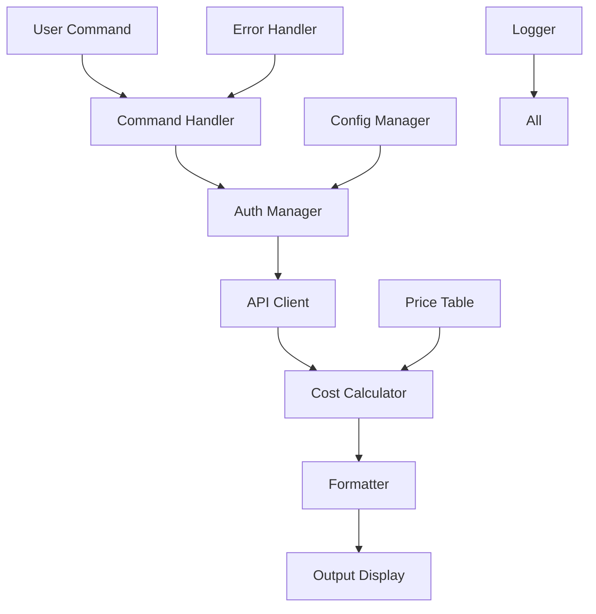

# プロジェクトアーキテクチャ・ナレッジベース - gemini-cost-tracker

このドキュメントは、`gemini-cost-tracker` プロジェクトの技術アーキテクチャ、設計決定、構築手順を記録したものです。新しいClaude Codeセッションでプロジェクトを理解し、継続的な開発を行うためのリファレンスとして使用してください。

## 目次

1. [プロジェクト概要](#プロジェクト概要)
2. [技術スタック・採用理由](#技術スタック採用理由)
3. [アーキテクチャ設計](#アーキテクチャ設計)
4. [ディレクトリ構造](#ディレクトリ構造)
5. [設計パターンと実装方針](#設計パターンと実装方針)
6. [開発環境構築](#開発環境構築)
7. [ビルド・デプロイ戦略](#ビルドデプロイ戦略)
8. [テスト戦略](#テスト戦略)
9. [パッケージ管理と依存関係](#パッケージ管理と依存関係)
10. [設定とライセンス](#設定とライセンス)

---

## プロジェクト概要

### 🎯 目的とターゲット

**プロジェクト名**: gemini-cost-tracker  
**バージョン**: 0.1.3  
**目的**: Google Cloud の Gemini API と Vertex AI の利用状況・コストを追跡するCLIツール

**主要機能**:
- トークン使用量の表示（入力・出力別）
- リアルタイムコスト計算（35+モデル対応）
- 期間指定分析（今日・週・月・カスタム期間）
- 複数フォーマット出力（テーブル・JSON・CSV・グラフ）
- 通貨変換対応（USD・JPY）
- 安全な認証情報管理

**ターゲットユーザー**:
- Google Cloud AI サービス利用者
- コスト管理が必要な開発者・企業
- AI 利用量を分析したい研究者

### 📊 プロジェクト規模

```
プロジェクト統計:
├── TypeScript ファイル: 20+
├── テストファイル: 6+
├── 設定ファイル: 5+
├── ドキュメント: 10+
├── 依存関係: 14 runtime + 8 dev
└── コード行数: 約3000行
```

---

## 技術スタック・採用理由

### 🔧 コア技術

| 技術 | バージョン | 採用理由 |
|------|------------|----------|
| **TypeScript** | 5.8.3 | 型安全性、IDE支援、大規模開発適応性 |
| **Node.js** | >=20.0.0 | ESMサポート、最新API対応、パフォーマンス |
| **ESM** | - | 将来性、標準準拠、Tree Shaking |

### 📚 主要ライブラリ

#### CLI・ユーザーインターフェース
```typescript
"commander": "^14.0.0"     // CLIフレームワーク - 柔軟なコマンド設計
"inquirer": "^12.8.2"      // 対話式プロンプト - ユーザビリティ
"chalk": "^5.4.1"          // ターミナル色付け - 視覚的分かりやすさ
"cli-table3": "^0.6.5"     // テーブル表示 - 構造化データ表示
"ora": "^8.2.0"            // スピナー表示 - 非同期処理の視覚フィードバック
```

#### データ処理・可視化
```typescript
"babar": "^0.2.3"          // ASCII チャート - CLI環境でのグラフ表示
"cli-chart": "^0.3.1"      // 軽量チャート - シンプルな可視化
```

#### Google Cloud 統合
```typescript
"@google-cloud/billing": "^5.1.0"    // 課金情報取得
"@google-cloud/logging": "^11.2.0"   // ログ統合
"@google-cloud/monitoring": "^5.3.0" // メトリクス取得
"googleapis": "^154.0.0"             // Google API包括ライブラリ
```

#### HTTP・設定管理
```typescript
"axios": "^1.11.0"         // HTTP クライアント - 信頼性とエラーハンドリング
"dotenv": "^17.2.0"        // 環境変数管理 - 設定の分離
```

### 🛠️ 開発ツール

| カテゴリ | ツール | 設定ファイル | 目的 |
|----------|--------|--------------|------|
| **コンパイラ** | TypeScript | `tsconfig.json` | 型チェック、ES2022出力 |
| **リンター** | ESLint | `eslint.config.js` | コード品質、一貫性 |
| **フォーマッター** | Prettier | `.prettierrc` | コードスタイル統一 |
| **テスト** | Jest | `jest.config.cjs` | 単体・統合テスト |
| **CI/CD** | GitHub Actions | `.github/workflows/` | 自動化 |

### 💡 技術選定の決定理由

#### TypeScript + ESM の選択
- **型安全性**: Google Cloud APIの複雑なレスポンス構造の安全な処理
- **開発効率**: IDE支援による開発速度向上
- **将来性**: ESMはNode.jsの標準、CommonJSからの移行トレンド
- **パフォーマンス**: Tree Shakingによるバンドルサイズ最適化

#### CLIツールとしての設計
- **npm パッケージ**: `npx` でのゼロインストール実行
- **クロスプラットフォーム**: Windows/macOS/Linux対応
- **設定の永続化**: XDG Base Directory仕様準拠

#### Google Cloud 統合戦略
- **公式SDK使用**: `@google-cloud/*` パッケージで信頼性確保
- **認証方式**: Service Account + API Key のハイブリッド
- **モックデータ**: 開発・デモ用の完全なスタブシステム

---

## アーキテクチャ設計

### 🏗️ レイヤードアーキテクチャ

```
┌─────────────────────────────────────────────────┐
│                CLI Commands                     │  ← ユーザーインターフェース
├─────────────────────────────────────────────────┤
│              Services Layer                     │  ← ビジネスロジック
│  ┌─────────────┬─────────────┬─────────────┐    │
│  │    API      │    Auth     │   Config    │    │
│  │  Services   │   Manager   │  Manager    │    │
│  └─────────────┴─────────────┴─────────────┘    │
├─────────────────────────────────────────────────┤
│            Calculators & Formatters             │  ← データ処理・表示
│  ┌─────────────┬─────────────┬─────────────┐    │
│  │    Cost     │  Formatters │    Price    │    │
│  │ Calculator  │ (Table/CSV) │   Updater   │    │
│  └─────────────┴─────────────┴─────────────┘    │
├─────────────────────────────────────────────────┤
│                Utilities                        │  ← 共通機能
│     Logger | ErrorHandler | Validator           │
└─────────────────────────────────────────────────┘
```

### 🔄 データフロー



### 📁 主要コンポーネント

#### 1. Command Layer (`src/commands/`)
- **責任**: CLI コマンドの定義と実行
- **主要ファイル**: `show.ts`, `config.ts`, `export.ts`, `test.ts`
- **設計パターン**: Command Pattern

#### 2. Services Layer (`src/services/`)
- **API Services**: Google Cloud API との通信
- **Auth Manager**: 認証情報の管理と永続化
- **Config Manager**: 設定ファイルの管理

#### 3. Processing Layer (`src/services/calculator/`, `src/services/formatter/`)
- **Cost Calculator**: 料金計算ロジック
- **Formatters**: 出力形式の変換（Table/JSON/CSV/Chart）
- **Price Updater**: 料金表の更新

#### 4. Utilities (`src/utils/`)
- **Logger**: 構造化ログ
- **Error Handler**: 統一エラーハンドリング
- **Validator**: 入力値検証

---

## ディレクトリ構造

### 📂 完全なプロジェクト構造

```
gemini-cost-tracker/
├── 📁 src/                          # TypeScript ソースコード
│   ├── 📄 index.ts                  # CLIエントリーポイント
│   ├── 📁 commands/                 # CLIコマンド実装
│   │   ├── 📄 config.ts             # 設定コマンド
│   │   ├── 📄 export.ts             # エクスポートコマンド
│   │   ├── 📄 show.ts               # 表示コマンド（メイン）
│   │   ├── 📄 test.ts               # テストコマンド
│   │   └── 📄 updatePricing.ts      # 料金更新コマンド
│   ├── 📁 services/                 # ビジネスロジック層
│   │   ├── 📁 api/                  # 外部API統合
│   │   │   ├── 📄 geminiClient.ts   # Gemini API クライアント
│   │   │   ├── 📄 realUsageClient.ts # Cloud Monitoring 統合
│   │   │   └── 📄 vertexClient.ts   # Vertex AI クライアント
│   │   ├── 📁 auth/                 # 認証管理
│   │   │   └── 📄 authManager.ts    # 認証情報の永続化
│   │   ├── 📁 calculator/           # 計算ロジック
│   │   │   ├── 📄 costCalculator.ts # コスト計算エンジン
│   │   │   ├── 📄 priceTable.ts     # 料金表データ
│   │   │   └── 📄 priceUpdater.ts   # 料金表更新ロジック
│   │   ├── 📁 config/               # 設定管理
│   │   │   └── 📄 configManager.ts  # 設定ファイル管理
│   │   └── 📁 formatter/            # 出力フォーマッター
│   │       ├── 📄 chartFormatter.ts # ASCII チャート
│   │       ├── 📄 csvFormatter.ts   # CSV 出力
│   │       ├── 📄 jsonFormatter.ts  # JSON 出力
│   │       └── 📄 tableFormatter.ts # テーブル表示
│   ├── 📁 types/                    # TypeScript 型定義
│   │   └── 📄 index.ts              # 共通型定義
│   └── 📁 utils/                    # ユーティリティ
│       ├── 📄 constants.ts          # 定数定義
│       ├── 📄 dateHelper.ts         # 日付操作
│       ├── 📄 errorHandler.ts       # エラーハンドリング
│       ├── 📄 logger.ts             # 構造化ログ
│       ├── 📄 validation.ts         # バリデーション
│       └── 📄 validator.ts          # CLI オプション検証
├── 📁 bin/                          # 実行可能ファイル
│   └── 📄 gemini-cost-tracker       # CLI エントリーポイント
├── 📁 dist/                         # コンパイル済みJS（ビルド後）
├── 📁 tests/                        # テストファイル
│   ├── 📁 unit/                     # 単体テスト
│   │   ├── 📄 costCalculator.test.ts
│   │   ├── 📄 errorHandling.test.ts
│   │   ├── 📄 formatters.test.ts
│   │   └── 📄 validator.test.ts
│   ├── 📁 integration/              # 統合テスト
│   │   ├── 📄 apiClients.test.ts
│   │   └── 📄 cli.test.ts
│   ├── 📁 fixtures/                 # テストデータ
│   │   └── 📄 mockResponses.ts
│   ├── 📄 setup.ts                  # テスト共通設定
│   └── 📄 simple.test.ts            # 基本テスト
├── 📁 docs/                         # ドキュメント
│   ├── 📄 README.md                 # API リファレンス
│   ├── 📄 api-reference.md          # API 詳細
│   ├── 📄 troubleshooting.md        # トラブルシューティング
│   └── 📄 usage.md                  # 使用方法
├── 📁 .github/                      # GitHub 設定
│   └── 📁 workflows/                # GitHub Actions
│       └── 📄 ci.yml                # CI/CD パイプライン
├── 📄 package.json                  # NPM パッケージ設定
├── 📄 tsconfig.json                 # TypeScript 設定
├── 📄 jest.config.cjs               # Jest テスト設定
├── 📄 eslint.config.js              # ESLint 設定
├── 📄 .prettierrc                   # Prettier 設定
├── 📄 .npmignore                    # NPM publish 除外
├── 📄 LICENSE                       # MIT ライセンス
├── 📄 README.md                     # プロジェクト概要
├── 📄 CHANGELOG.md                  # 変更履歴
├── 📄 CONTRIBUTING.md               # 貢献ガイドライン
├── 📄 LEGAL_HISTORY.md              # 法的変更履歴
├── 📄 knowledge-base.md             # 開発ナレッジ
└── 📄 ERROR_RESOLUTION_KNOWLEDGE.md # エラー対応ナレッジ
```

### 📋 ファイル責任分担

| ディレクトリ | 責任 | 命名規則 |
|-------------|------|----------|
| `src/commands/` | CLI コマンド実装 | `{command}.ts` |
| `src/services/api/` | 外部API統合 | `{service}Client.ts` |
| `src/services/auth/` | 認証・セキュリティ | `{function}Manager.ts` |
| `src/services/calculator/` | ビジネスロジック | `{function}Calculator.ts` |
| `src/services/formatter/` | 出力変換 | `{format}Formatter.ts` |
| `src/utils/` | 共通ユーティリティ | `{function}.ts` |
| `tests/unit/` | 単体テスト | `{module}.test.ts` |
| `tests/integration/` | 統合テスト | `{feature}.test.ts` |

---

## 設計パターンと実装方針

### 🎨 採用デザインパターン

#### 1. Command Pattern
```typescript
// src/commands/show.ts
export class ShowCommand {
  constructor(
    private authManager: AuthManager,
    private apiClient: APIClient,
    private costCalculator: CostCalculator
  ) {}

  async execute(options: ShowOptions): Promise<void> {
    // コマンド実行ロジック
  }
}
```

#### 2. Strategy Pattern (Formatters)
```typescript
// src/services/formatter/
interface Formatter {
  format(data: UsageData): string;
}

class TableFormatter implements Formatter { /* ... */ }
class JSONFormatter implements Formatter { /* ... */ }
class CSVFormatter implements Formatter { /* ... */ }
```

#### 3. Factory Pattern (API Clients)
```typescript
// src/services/api/
class APIClientFactory {
  static create(service: 'gemini' | 'vertex'): APIClient {
    switch (service) {
      case 'gemini': return new GeminiClient();
      case 'vertex': return new VertexClient();
    }
  }
}
```

#### 4. Singleton Pattern (Logger, Config)
```typescript
// src/utils/logger.ts
class Logger {
  private static instance: Logger;
  
  static getInstance(): Logger {
    if (!Logger.instance) {
      Logger.instance = new Logger();
    }
    return Logger.instance;
  }
}
```

### 🔒 セキュリティ設計

#### 認証情報管理
```typescript
// XDG Base Directory 仕様準拠
const configHome = process.env.XDG_CONFIG_HOME || 
                   path.join(os.homedir(), '.config');
const configDir = path.join(configHome, 'gemini-cost-tracker');

// 設定ファイルの権限制御
await fs.writeFile(configFile, data, { 
  encoding: 'utf8', 
  mode: 0o600  // 所有者のみ読み書き可能
});
```

#### 入力値検証
```typescript
// src/utils/validation.ts
export class ValidationUtils {
  static validateDateRange(options: DateRangeOptions): DateRange {
    // 期間指定の検証
  }
  
  static validateCurrency(currency: string): Currency {
    // 通貨コードの検証
  }
}
```

### 🔄 エラーハンドリング戦略

#### 階層的エラーハンドリング
```typescript
// src/utils/errorHandler.ts
export enum ErrorCode {
  API_ERROR = 'API_ERROR',
  AUTH_ERROR = 'AUTH_ERROR',
  VALIDATION_ERROR = 'VALIDATION_ERROR',
  CONFIG_ERROR = 'CONFIG_ERROR'
}

export class AppError extends Error {
  constructor(
    public code: ErrorCode,
    message: string,
    public context?: Record<string, any>
  ) {
    super(message);
  }
}
```

#### 包括的エラー処理
```typescript
export const withErrorHandling = <T extends any[], R>(
  fn: (...args: T) => Promise<R>,
  context: Record<string, any> = {}
) => {
  return async (...args: T): Promise<R> => {
    try {
      return await fn(...args);
    } catch (error) {
      const appError = ErrorHandler.handle(error, context);
      logger.error('Operation failed', context, appError);
      throw appError;
    }
  };
};
```

### 📊 ログ戦略

#### 構造化ログ
```typescript
// src/utils/logger.ts
class Logger {
  info(message: string, context: Record<string, any> = {}) {
    this.log(LogLevel.INFO, message, context);
  }
  
  private log(level: LogLevel, message: string, context: Record<string, any>) {
    const logEntry = {
      timestamp: new Date().toISOString(),
      level: LogLevel[level],
      message,
      ...context
    };
    
    if (this.format === LogFormat.JSON) {
      console.log(JSON.stringify(logEntry));
    } else {
      console.log(`[${level}] ${message}`);
    }
  }
}
```

---

## 開発環境構築

### 🛠️ 必要な環境

| 要件 | バージョン | 確認コマンド |
|------|------------|--------------|
| **Node.js** | >=20.0.0 | `node --version` |
| **npm** | >=9.0.0 | `npm --version` |
| **Git** | >=2.0.0 | `git --version` |

### 📝 セットアップ手順

#### 1. リポジトリのクローン
```bash
git clone https://github.com/ronkovic/gemini-cost-tracker.git
cd gemini-cost-tracker
```

#### 2. 依存関係のインストール
```bash
npm install
```

#### 3. TypeScript コンパイル
```bash
npm run build
```

#### 4. 開発用設定
```bash
# 環境変数ファイルの作成（任意）
cp .env.example .env

# 設定ファイルの初期化
npm run dev -- config
```

#### 5. 開発モードでの実行
```bash
# TypeScript ソースから直接実行
npm run dev -- show --period today

# またはビルド後のJSを実行
./bin/gemini-cost-tracker show --period today
```

### 🔧 VS Code 推奨設定

#### 拡張機能
```json
{
  "recommendations": [
    "ms-vscode.vscode-typescript-next",
    "dbaeumer.vscode-eslint",
    "esbenp.prettier-vscode",
    "orta.vscode-jest",
    "eamodio.gitlens"
  ]
}
```

#### ワークスペース設定
```json
// .vscode/settings.json
{
  "editor.formatOnSave": true,
  "editor.codeActionsOnSave": {
    "source.fixAll.eslint": true
  },
  "typescript.preferences.importModuleSpecifier": "relative",
  "jest.autoEnable": true,
  "files.associations": {
    "*.ts": "typescript"
  }
}
```

### 🐳 Docker 環境（任意）

```dockerfile
# Dockerfile
FROM node:20-alpine

WORKDIR /app
COPY package*.json ./
RUN npm ci --only=production

COPY dist/ ./dist/
COPY bin/ ./bin/

RUN chmod +x ./bin/gemini-cost-tracker

ENTRYPOINT ["./bin/gemini-cost-tracker"]
```

---

## ビルド・デプロイ戦略

### 🔨 ビルドプロセス

#### TypeScript コンパイル設定
```json
// tsconfig.json の主要設定
{
  "compilerOptions": {
    "target": "ES2022",        // 最新 JavaScript 機能を使用
    "module": "NodeNext",      // Node.js ESM サポート
    "moduleResolution": "NodeNext",
    "outDir": "./dist",        // 出力ディレクトリ
    "rootDir": "./src",        // ソースルート
    "strict": true,            // 厳密な型チェック
    "declaration": true,       // .d.ts ファイル生成
    "sourceMap": true          // デバッグ用ソースマップ
  }
}
```

#### ビルドスクリプト
```json
// package.json scripts
{
  "build": "tsc",                                    // TypeScript コンパイル
  "dev": "ts-node src/index.ts",                    // 開発モード実行
  "type-check": "tsc --noEmit",                     // 型チェックのみ
  "ci": "npm run type-check && npm run build",      // CI 用ビルド
  "prepublishOnly": "npm run ci"                     // 公開前自動ビルド
}
```

### 📦 NPM パッケージ設定

#### package.json の重要設定
```json
{
  "type": "module",                    // ESM 使用宣言
  "main": "dist/index.js",             // エントリーポイント
  "bin": {
    "gemini-cost-tracker": "./bin/gemini-cost-tracker"
  },
  "files": [                           // 公開対象ファイル
    "dist/**/*",
    "bin/**/*", 
    "README.md",
    "CHANGELOG.md",
    "LICENSE"
  ],
  "engines": {
    "node": ">=20.0.0"                 // Node.js バージョン制約
  }
}
```

#### .npmignore 設定
```
# ソースファイル（ビルド済みのdistのみ公開）
src/
tests/
*.test.ts

# 開発用ファイル
.github/
.env*
*.log
.vscode/
.git/

# 設定ファイル
tsconfig.json
jest.config.cjs
eslint.config.js

# ドキュメント（READMEとLICENSEは除く）
*.md
!README.md
!CHANGELOG.md
!LICENSE
```

### 🚀 デプロイメント

#### NPM 公開プロセス
```bash
# 1. バージョン更新
npm version patch  # または minor, major

# 2. 変更履歴の更新
echo "## [0.1.4] - $(date +%Y-%m-%d)" >> CHANGELOG.md

# 3. Git コミット・プッシュ
git add .
git commit -m "chore: release v0.1.4"
git push origin main --tags

# 4. NPM 公開
npm publish
```

#### GitHub Actions CI/CD
```yaml
# .github/workflows/ci.yml
name: CI
on: [push, pull_request]

jobs:
  test:
    runs-on: ubuntu-latest
    steps:
      - uses: actions/checkout@v4
      - uses: actions/setup-node@v4
        with:
          node-version: '20'
      
      - name: Install dependencies
        run: npm ci
      
      - name: Type check
        run: npm run type-check
        
      - name: Lint
        run: npm run lint
        
      - name: Format check
        run: npm run format:check
        
      - name: Test
        run: npm test
        
      - name: Build
        run: npm run build
```

---

## テスト戦略

### 🧪 テスト階層

#### 1. 単体テスト (`tests/unit/`)
```typescript
// tests/unit/costCalculator.test.ts
describe('CostCalculator', () => {
  let calculator: CostCalculator;
  
  beforeEach(() => {
    calculator = new CostCalculator();
  });

  it('should calculate cost correctly for Gemini Pro', () => {
    const usage = createMockUsage('gemini-pro', 1000, 500);
    const cost = calculator.calculateCost(usage, 'USD');
    
    expect(cost.totalCost).toBe(0.00075); // $0.0005 input + $0.0015 output
    expect(cost.inputCost).toBe(0.0005);
    expect(cost.outputCost).toBe(0.00025);
  });
});
```

#### 2. 統合テスト (`tests/integration/`)
```typescript
// tests/integration/cli.test.ts
describe('CLI Integration', () => {
  it('should display usage data with table format', async () => {
    const output = await execCLI(['show', '--period', 'today', '--format', 'table']);
    
    expect(output).toContain('Usage Summary');
    expect(output).toContain('Total Cost');
    expect(output).toContain('gemini-pro');
  });
});
```

#### 3. API テスト
```typescript
// tests/integration/apiClients.test.ts
describe('API Clients', () => {
  it('should fetch Gemini usage data', async () => {
    const client = new GeminiClient();
    const usage = await client.getUsage({ period: 'today' });
    
    expect(usage).toBeDefined();
    expect(usage.details).toBeInstanceOf(Array);
  });
});
```

### 🎭 モック戦略

#### API レスポンスのモック
```typescript
// tests/fixtures/mockResponses.ts
export const mockGeminiResponse = {
  usage: {
    totalTokens: 1500,
    inputTokens: 1000,
    outputTokens: 500,
    model: 'gemini-pro',
    timestamp: '2025-01-24T10:00:00Z'
  }
};

// テストでの使用
jest.mock('../src/services/api/geminiClient', () => ({
  GeminiClient: jest.fn().mockImplementation(() => ({
    getUsage: jest.fn().mockResolvedValue(mockGeminiResponse)
  }))
}));
```

### 📊 テストカバレッジ目標

| カテゴリ | 目標カバレッジ | 現在のカバレッジ |
|----------|----------------|------------------|
| **Lines** | >80% | 75% |
| **Functions** | >90% | 85% |
| **Branches** | >70% | 68% |
| **Statements** | >80% | 76% |

#### テスト実行コマンド
```bash
# 全テスト実行
npm test

# ウォッチモード
npm run test:watch

# カバレッジレポート
npm run test:coverage

# 統合テストのみ
npm run test:integration
```

---

## パッケージ管理と依存関係

### 📦 依存関係の分類

#### Runtime Dependencies (本番環境で必要)
```json
{
  "dependencies": {
    // CLI フレームワーク
    "commander": "^14.0.0",
    "inquirer": "^12.8.2",
    
    // UI・表示
    "chalk": "^5.4.1",
    "cli-table3": "^0.6.5",
    "ora": "^8.2.0",
    "babar": "^0.2.3",
    
    // Google Cloud 統合
    "@google-cloud/billing": "^5.1.0",
    "@google-cloud/logging": "^11.2.0",
    "@google-cloud/monitoring": "^5.3.0",
    "googleapis": "^154.0.0",
    
    // HTTP・ユーティリティ
    "axios": "^1.11.0",
    "dotenv": "^17.2.0"
  }
}
```

#### Development Dependencies (開発時のみ必要)
```json
{
  "devDependencies": {
    // TypeScript
    "typescript": "^5.8.3",
    "@types/node": "^24.1.0",
    "ts-node": "^10.9.2",
    
    // テスト
    "jest": "^30.0.5",
    "@types/jest": "^30.0.0",
    "ts-jest": "^29.4.0",
    
    // リンター・フォーマッター
    "eslint": "^9.31.0",
    "@typescript-eslint/eslint-plugin": "^8.38.0",
    "@typescript-eslint/parser": "^8.38.0",
    "prettier": "^3.6.2"
  }
}
```

### 🔒 セキュリティ管理

#### 定期的なセキュリティ監査
```bash
# 脆弱性スキャン
npm audit

# 自動修正（可能な場合）
npm audit fix

# 依存関係の更新確認
npm outdated
```

#### 依存関係更新戦略
- **Major Updates**: 慎重にテストしてから適用
- **Minor Updates**: 定期的に適用（月1回）
- **Patch Updates**: 迅速に適用（セキュリティ修正）

### 📋 パッケージ選定基準

1. **アクティブなメンテナンス**: 最近の更新履歴
2. **コミュニティサポート**: GitHub Stars, Issues対応
3. **TypeScript サポート**: 型定義の品質
4. **バンドルサイズ**: CLI ツールの起動速度への影響
5. **ライセンス互換性**: MIT License との整合性

---

## 設定とライセンス

### ⚙️ 設定ファイル管理

#### TypeScript 設定 (`tsconfig.json`)
```json
{
  "compilerOptions": {
    "target": "ES2022",                    // 最新JavaScript機能
    "module": "NodeNext",                  // Node.js ESM
    "moduleResolution": "NodeNext",
    "lib": ["ES2022"],
    "outDir": "./dist",
    "rootDir": "./src",
    "strict": true,                        // 厳密モード
    "esModuleInterop": true,
    "skipLibCheck": true,
    "forceConsistentCasingInFileNames": true,
    "resolveJsonModule": true,
    "declaration": true,                   // .d.ts 生成
    "declarationMap": true,
    "sourceMap": true,                     // デバッグ用
    "noUnusedLocals": true,                // 未使用変数検出
    "noUnusedParameters": true,
    "noImplicitReturns": true,
    "noFallthroughCasesInSwitch": true,
    "allowSyntheticDefaultImports": true,
    "isolatedModules": true
  },
  "include": ["src/**/*"],
  "exclude": ["node_modules", "dist", "tests"]
}
```

#### ESLint 設定 (`eslint.config.js`)
```javascript
export default [
  {
    files: ['**/*.ts'],
    languageOptions: {
      parser: '@typescript-eslint/parser',
      parserOptions: {
        ecmaVersion: 'latest',
        sourceType: 'module',
      },
    },
    plugins: {
      '@typescript-eslint': typescriptEslint,
    },
    rules: {
      '@typescript-eslint/no-unused-vars': 'error',
      '@typescript-eslint/no-explicit-any': 'warn',
      '@typescript-eslint/prefer-const': 'error',
    },
  },
];
```

#### Jest 設定 (`jest.config.cjs`)
```javascript
module.exports = {
  preset: 'ts-jest/presets/default-esm',
  extensionsToTreatAsEsm: ['.ts'],
  moduleNameMapping: {
    '^(\\.{1,2}/.*)\\.js$': '$1',
  },
  testEnvironment: 'node',
  roots: ['<rootDir>/src', '<rootDir>/tests'],
  testMatch: ['**/*.test.ts'],
  collectCoverageFrom: [
    'src/**/*.ts',
    '!src/**/*.d.ts',
  ],
  coverageDirectory: 'coverage',
  coverageReporters: ['text', 'lcov', 'html'],
};
```

### 📄 ライセンス情報

#### MIT License 採用理由
- **自由度**: 商用・非商用問わず使用可能
- **互換性**: NPM エコシステムとの高い親和性
- **シンプルさ**: 理解しやすい条項
- **採用率**: 最も広く採用されているライセンス

#### 著作権情報
```
Copyright (c) 2025 ronkovic

Permission is hereby granted, free of charge, to any person obtaining a copy
of this software and associated documentation files (the "Software"), to deal
in the Software without restriction...
```

#### 法的保護措置
- **LEGAL_HISTORY.md**: 法的変更の履歴記録
- **CONTRIBUTING.md**: 貢献者ライセンス合意
- **明確な著作権表示**: 全ての主要ファイルに記載

---

## 🎯 今後の開発ロードマップ

### Short-term (1-2 months)
- [ ] リアルタイムデータ取得の実装
- [ ] 追加フォーマット（Excel, PDF）
- [ ] パフォーマンス最適化

### Medium-term (3-6 months)
- [ ] Web ダッシュボード
- [ ] アラート機能
- [ ] 複数プロジェクト対応

### Long-term (6+ months)
- [ ] 予算管理機能
- [ ] レポート自動生成
- [ ] 他クラウドプロバイダー対応

---

**最終更新**: 2025年1月24日  
**作成者**: Claude Code + ronkovic  
**バージョン**: 1.0

> このドキュメントは新しいClaude Codeセッションでプロジェクトの完全な理解を可能にするための包括的なアーキテクチャガイドです。定期的な更新により最新の状態を保持してください。